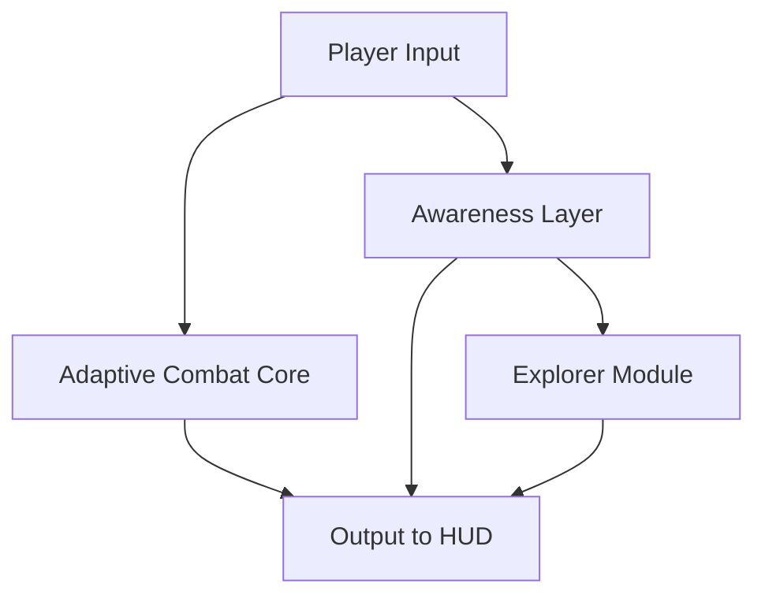

# ELDEN RING Cheat Tool

In the mist-draped expanse of the Lands Between, where every shadow carries a whisper and each blade sings its own tale, this cheat tool rises like a hidden rune—subtle, potent, endlessly shapeable. Consider this README your lantern in the deep, guiding you through a software crafted for those who wish to sculpt their path with intention, grace, and just a touch of sorcery.

---

## 🌿 Overview

This ELDEN RING cheat suite adds a responsive layer of augmentation atop your journey. It doesn’t scream for attention—it murmurs, gently adjusting combat flow, vision, mobility, and discovery. Whether you tread like a drifting poet or charge as a storm crowned in lightning, the tool adapts to your rhythm.

[!NOTE]
This edition emphasizes *customization & accessibility*, celebrating players who fine-tune the Lands Between like a lute string humming at dawn.

---

## 🔮 Features

Like fragments of an ancient spellbook, each module weaves seamlessly into the next.

### **Adaptive Combat Module**

* Enemy soft-lock augmentation
* Smooth tracking curves (Suggested values: `4.3–6.8`)
* Custom stamina drain multipliers
* Per-weapon motion templates (katanas, colossal weapons, twinblades)

### **Awareness & Vision Enhancer**

* Enemy silhouettes in spectral gold
* Boss arena perimeter highlights
* “Danger Pulse” indicators for fast, aggressive moves
* Rune pickup beacons with range-based color fading

### **World Sense: Explorer Mode**

* Ghostly path-lines for dungeons
* Hidden wall notifier (low-contrast shimmer)
* Item rarity glow system
* Spirit ash hotspot awareness markers

### **Performance & Reliability**

* Lightweight async overlay
* Auto-restart recovery if GPU load spikes
* XML-driven tuning for rapid experimentation
* Clean process isolation

---

## 🌙 Activation Badges


---

## 🛡 Compatibility

Like a shield carved from ancient brass—broad, durable, reassuring.

| Component | Support                                    |
| --------- | ------------------------------------------ |
| OS        | Windows 10/11                              |
| CPU       | Intel/AMD x64                              |
| Display   | Borderless, Windowed, Fullscreen           |
| Input     | Mouse, Controller, High-DPI devices        |
| Notes     | Accessibility & contrast controls included |

[!IMPORTANT]
Disable in-game chromatic aberration for a cleaner overlay rendering.

---

## ⚡ Setup

Let us carve your path step by gentle step.

### **1. Installation**

Extract the archive, then summon:

```
eldencheat.exe --preset wanderer.xml
```

### **2. Base Preset Template**

Create `moonveil_profile.ini` for a soft but sharp combat style:

```ini
[combat]
tracking=5.2
stamina_modifier=0.85
soft_lock=true

[vision]
enemy_glow=#ad8bff
loot_rarity=rare
boss_perimeter=true

[exploration]
pathsense=true
hiddenwall_hint=true
```

### **3. Hotkeys**

* Toggle adaptive combat: **F4**
* Toggle awareness overlay: **END**
* Spirit ash pulse: **ALT + S**

### **4. Injection Command**

Whisper softly to the executable:

```
cheat inject --async --veil-mode
```

---

## ✨ System Flow Diagram

A map of enchantments, drifting like a constellation.



---

## 📘 FAQ – Wisdom for the Traveling Tarnished

### **Can I create multiple themed profiles?**

Yes—craft builds like “Samurai Dawn,” “Frost Faith,” or “Colossal Tempest” and switch at will.

### **Does it support boss-specific behavior?**

You may assign separate tracking curves and stamina multipliers for bosses like Malenia or Maliketh.

### **Will it affect FPS?**

The async overlay keeps performance impact small, even during particle-heavy battles.

### **How often are updates released?**

Typically weekly, aligned with balance patches for weapons, ashes, and incantations.

### **Is controller input supported?**

Absolutely—rumble cues can even be adapted for danger pulses.

---

## 🌾 Final Thoughts

To wander the Lands Between is to embrace a wild symphony of ruin and beauty. This cheat tool doesn’t shatter that music—it simply gives you a clearer voice within it. A little more breath. A little more reach. A little more magic curling at your fingertips as you walk beneath the falling leaves.

---
